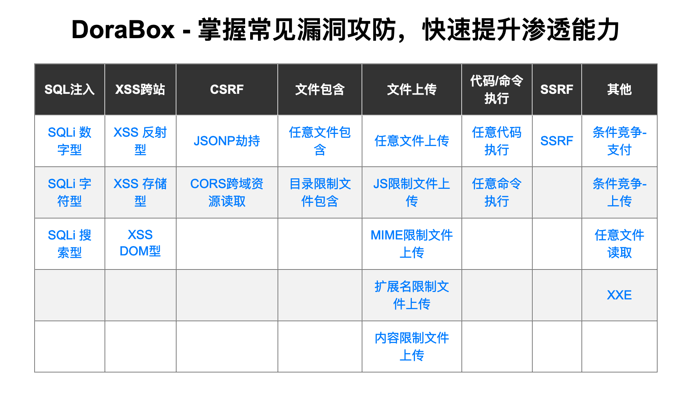

# 前言

DoraBox，名字起源于哆啦A梦的英文，几个月前就写了这个靶场但是那时候是用来做教学培训的，两个小时前，被强迫症的自己强迫重写了代码，对一些问题进行了修改，增加了一些新的东西。

希望DoraBox能帮助你像大雄借助哆啦A梦的百宝袋一样学习到一些东西。



# DoraBox - 多拉盒

掌握常见漏洞攻防，快速提升渗透能力

界面很丑，学过前端，但是懒得去搞了，希望谅解。

DoraBox 的组成部分：


1.MySQL数据库(pentest.sql 导入到MySQL中即可)

**db_name:pentest**

| table_name | column_name                              |
| ---------- | ---------------------------------------- |
| account    | Id(int11),rest(varchar255),own(varchar255) |
| news       | id(int11),title(varchar45),content(varchar45) |

2.PHP

- conn.php 数据库配置文件
- class/function.class.php 核心功能文件
- 其他的差不多是咸鱼(开个玩笑)

大部分的功能实现是借助如下成员方法(**代码写的烂，也请忍受下 \*_\***)：

```php
public function con_function(){
	//自己造的回调
	$func_array = func_get_args();
	$name = func_get_arg(0);
	array_shift($func_array);
	echo "<hr>";
	return call_user_func_array($name,$func_array);
}
```


3.集合的漏洞类型：（这里的限制是只可以绕过）

- SQL注入：数字型、字符型、搜索型
- XSS：反射型、存储型、DOM型
- 文件包含：任意、目录限制
- 文件上传：任意、JS限制、MIME限制、扩展名限制、内容限制
- 代码/命令执行：任意
- SSRF：SSRF（回显）
- 其他：条件竞争（支付&上传）、任意文件读取
- CSRF：这里我没有写，因为没有什么必要，当时讲课的时候是想到完全可以结合其他的漏洞类型讲解

除此之外还有一些poc、exp在项目中，自己发现咯~

如果有建议或者问题可以发送到邮箱:gh0stkey@qq.com

## Docker
最近在部署自己的靶场(Dorabox 链接：https://github.com/gh0stkey/DoraBox) 在Docker上，虽然以前学过但是没有真正的自己去部署，实际操作还是遇到了很多坑。

首先我pull下来的是tutum/lamp，当我创建容器的时候，我发现了run.sh(当创建容器后运行)这个坑，对其进行了修改；还有一个坑就是，当我commit容器为镜像，再从这个镜像中创建容器的时候发现Mysql数据没有存留，所以我在run.sh内写入了 `mysql < /var/www/html/pentest.sql` 这个语句，当创建时自动导入pentest.sql文件，这样我就可以做到数据初始化了。

假回滚：
一个脚本定时进行回滚（初始化）：
```bash
#!/bin/bash
while true
do
	echo "----------[ Starting ]----------"
	docker container kill dorabox
	docker container rm dorabox
	docker run -d --name dorabox -p 8080:80 dorabox:ghost
	echo "----------[ Finished ]----------"
	sleep 10m
done
```
修改sleep 10m为你想要做的定时时间（**别忘记运行的时候使用root权限**）
如何获取到我这个Docker镜像？
运行这条命令：
```bash
$ sudo docker pull registry.cn-qingdao.aliyuncs.com/dorabox/dorabox:lastest
```
接下来你可以运行：
```bash
$ sudo docker run -d --name dorabox -p 8080:80 dorabox:lastest
$ sudo ./rollback.sh
```
这时候你在本地的8080端口就运行这DoraBox的web服务。

